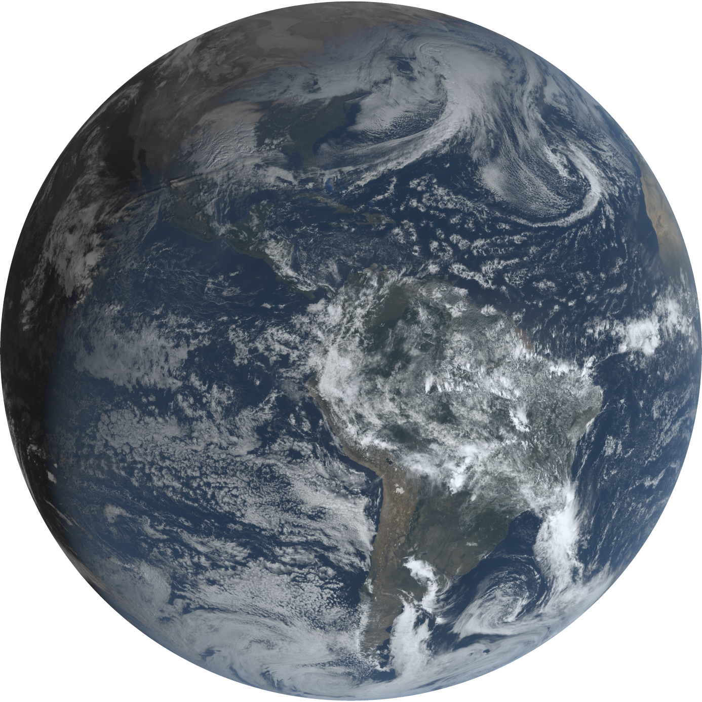

# graphical-goes

This project attempts to create a graphic interface for fetching live satellite data, and processing the raw data into high-quality images.
The overarching goal is to create a web deployable frontend with options for varying GOES satellite bands and zooms.

Special thanks to @occ-data for the guide on reading and manipulating GOES-16 data.
